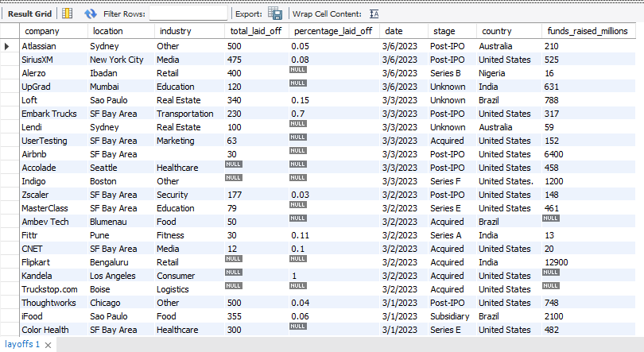
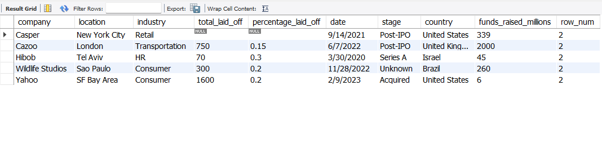
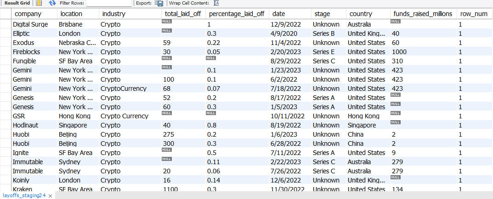
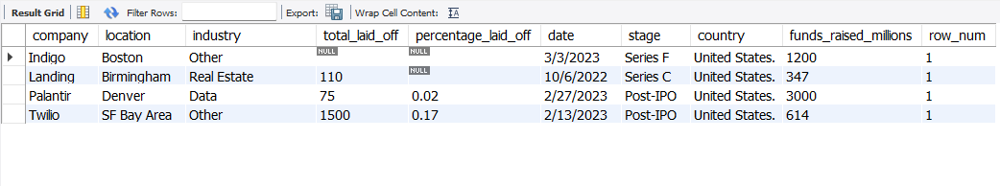
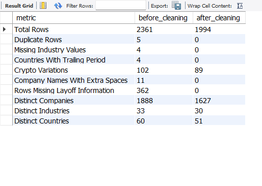
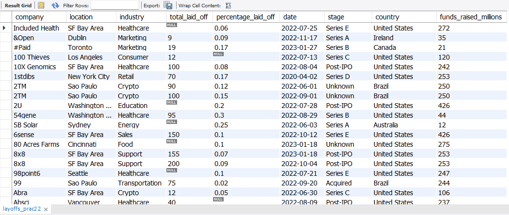

# SQL Data Cleaning Project: Global Layoffs Dataset

## Project Overview
In this project, I cleaned a global layoffs dataset using MySQL to address common data quality issues and prepare the data for analysis. Through this project, I practiced real-world data cleaning techniques that are commonly used in data analytics workflows.

## Dataset Columns
The dataset contains the following information:

- Company
- Location
- Industry
- Total Laid Off
- Percentage Laid Off
- Date
- Stage
- Country
- Funds Raised (Millions)

## Data Cleaning Tasks Performed
In this project, I:

- Removed duplicate records using window functions
- Standardized inconsistent text values
- Converted text dates into the `DATE` data type
- Handled missing and blank values
- Removed unnecessary rows and columns
- Created project metrics to compare the dataset before and after cleaning

## SQL Concepts Used
- Window Functions (`ROW_NUMBER()`)
- String Functions (`TRIM()`)
- Date Functions (`STR_TO_DATE()`)
- Self Joins
- `UPDATE` and `DELETE` Statements
- `ALTER TABLE`
- Temporary Tables

## Project Screenshots

### Original Dataset Preview
I first explored the raw dataset to understand its structure and identify potential data quality issues that needed to be cleaned.

### Duplicate Records Identified
I used the `ROW_NUMBER()` window function to identify duplicate records before removing them from the dataset.

### Data Standardization Example 1
I found inconsistent values in the `industry` column, such as `Cryptocurrency` and `Crypto Currency`. To improve consistency, I standardized these variations into a single value: `Crypto`.

### Data Standardization Example 2
I found that some values in the `country` column contained a trailing period, such as `United States.`. I removed the extra punctuation to ensure that country names were stored consistently throughout the dataset.

### Project Metrics Summary
I created project metrics to compare the dataset before and after cleaning and to measure the improvements made during the cleaning process.

### Cleaned Dataset Preview
This screenshot shows a sample of the final cleaned dataset after completing all the data cleaning steps. The dataset is now more consistent and ready for further analysis.

## Project Files
- `data_cleaning.sql` – Complete SQL data cleaning script
- `layoffs.csv` – Original dataset
- `README.md` – Project documentation and screenshots

